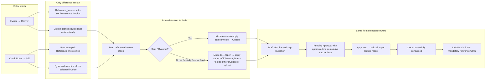
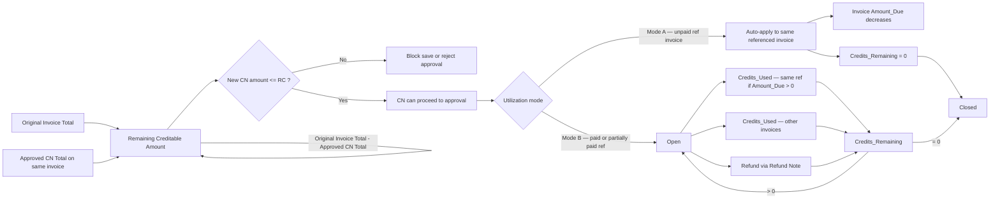

# Credit Note — Correct End-to-End Flow

## 0. Reference Invoice Status — Determines CN Utilization (Both Paths)

When `Reference_Invoice` is set (convert or manual), the system reads the invoice blueprint stage **at creation** and locks the post-approval utilization mode for that credit note. *(Q21: re-evaluate at approval — deferred; see § Deferred below.)*

| Reference invoice stage | Meaning | After CN is Approved |
|-------------------------|---------|----------------------|
| **Sent** or **Overdue** | Unpaid — customer still owes on this invoice | Auto-apply to **same** `Reference_Invoice` only → reduce `Amount_Due` → `Credits_Remaining = 0` → **Closed**. Cannot apply to other invoices. Cannot create Refund Note. |
| **Partially Paid** | Customer paid part of this invoice | CN stays **Open**. Does **not** auto-apply at approval. User may manually apply to **same** reference invoice if `Amount_Due > 0`, or to **other** invoices, or refund via Refund Note. |
| **Paid** | Customer fully paid this invoice | CN stays **Open**. Reference invoice `Amount_Due = 0` — apply to **other** invoices or refund only (same reference invoice not eligible). |

```mermaid
flowchart TD
    START[Reference_Invoice selected or set by convert] --> DET{Detect reference invoice blueprint stage}

    DET -->|Sent or Overdue| MODE_A["Mode A — Debt reduction only"]
    DET -->|Partially Paid| MODE_B["Mode B — Open credit"]
    DET -->|Paid| MODE_B

    MODE_A --> A1[After approval: auto-apply to same invoice only]
    A1 --> A2[Credits_Remaining = 0]
    A2 --> A3[Blueprint = Closed]

    MODE_B --> B1[After approval: Blueprint = Open]
    B1 --> B2{How is credit used?}
    B2 -->|Ref invoice Amount_Due > 0| B2A[Apply to same Reference_Invoice manually]
    B2 -->|Other open invoice(s)| B3[Apply Credits to Invoices — other invoice(s)]
    B2 -->|Cash back| B4[Create Refund Note from CN]
    B2A --> B5
    B3 --> B5{Credits_Remaining?}
    B4 --> B5
    B5 -->|> 0| B1
    B5 -->|= 0| B6[Blueprint = Closed]
```

**Shared rules (all modes):**
- `Reference_Invoice` is mandatory; must have valid LHDN `Invoice_UUID`.
- Line items are cloned from the referenced invoice; user may only reduce qty or amount per line.
- Multiple CNs per invoice allowed; **total approved CN amount** must not exceed original invoice total.
- Cap is checked at **save** and re-checked at **approval** (blocks 3rd CN if first two already consume the cap).
- **Mode B apply rule (Q22):** User may apply to the **same** reference invoice only when that invoice `Amount_Due > 0`; otherwise apply to other invoices or refund only.

---

## Deferred — later implementation (known edge-case gaps)

These are **out of scope for the first fix pass**. Behaviour below is what we ship now; the preferred answers from Q&A are noted for a follow-up.

| Item | Q&A | Ship now (v1) | Preferred later | Known risk if deferred |
|------|-----|---------------|-----------------|------------------------|
| **Utilization mode timing** | Q21 | **Locked at creation** — mode set when CN is created / convert runs | **A** — re-evaluate reference invoice stage at **approval** | CN created against Sent invoice may stay Mode A even if customer pays before approval |
| **Draft / pending cap reservation** | Q10, Q23 | **B** — only **approved** CNs count toward cap at save; approval-time recheck for approved totals | **Strict** — also reserve cap for Draft + Pending Approval CNs on same invoice | Concurrent drafts or overlapping approvals can over-credit until approval recheck blocks one |

**First fix pass still implements:** mandatory `Reference_Invoice`, line clone/reduce-only, Mode A vs B, Q22 apply rule, per-line + cumulative cap (approved totals), approval-time recheck, LHDN when Closed with reference UUID.

---

## 1. Credit Note from Invoice (Convert)

```mermaid
flowchart TD
    A[Invoice: Sent / Partially Paid / Paid / Overdue] --> B{User clicks Convert to Credit Note}
    B --> B0{Detect source invoice stage}
    B0 -->|Sent or Overdue| B0A["Lock Mode A — debt reduction only"]
    B0 -->|Partially Paid or Paid| B0B["Lock Mode B — open credit"]

    B0A --> C[System creates Draft Credit Note]
    B0B --> C

    C --> C1[Set Reference_Invoice = source invoice with valid Invoice_UUID]
    C --> C2[Clone source line items exactly: item code, tax, unit price]
    C --> C3[User may reduce qty or amount only; no new unrelated items]
    C --> C4[Generate CN number once]
    C --> C5[Draft]

    C5 --> D[Save Draft]
    D --> E{Draft validation}
    E -->|Pass| F[Send for Approval]
    E -->|Fail| D1[Block save: amount or line mismatch]

    F --> G[Pending Approval]
    G --> H{Approver}
    H -->|Reject| I[Rejected -> fix -> Resubmit]
    I --> G
    H -->|Approve| J[Approval-time control checks]
    J --> J1[Recalculate latest approved CN total on same Reference_Invoice]
    J1 --> J2{Existing approved credits + this CN <= original invoice total?}
    J2 -->|No| K[Reject approval: exceed original invoice cap]
    J2 -->|Yes| L[Approved]

    L --> M{Utilization mode locked at creation?}

    M -->|Mode A — Sent or Overdue| N[Auto-apply CN to same Reference_Invoice only]
    N --> N1[Reduce referenced invoice Amount_Due immediately]
    N1 --> N2[Set Credits_Remaining = 0]
    N2 --> N3[No Apply to other invoices / No Refund Note]
    N3 --> O[Blueprint = Closed]

    M -->|Mode B — Partially Paid or Paid| P[Blueprint = Open]
    P --> P1{How is credit used?}
    P1 -->|Ref invoice Amount_Due > 0| P1A[Apply to same Reference_Invoice]
    P1A --> P2[Apply Credits to Invoices popup]
    P1 -->|Apply to other invoice(s)| P2
    P2 --> P3[Update CN Credits_Used + Credits_Remaining]
    P1 -->|Cash back| P4[Create Refund Note from CN]
    P4 --> P5[Update CN Refund + Credits_Remaining]
    P3 --> P6{Credits_Remaining?}
    P5 --> P6
    P6 -->|> 0| P
    P6 -->|= 0| O

    O --> Q[Submit Credit Note to LHDN]
    Q --> Q1[Payload must include Reference_Invoice UUID + invoice number]
    Q1 --> R[Store CN UUID + public link]
    R --> S[Done]
```

---

## 2. Credit Note from Credit Notes Module (Manual)

```mermaid
flowchart TD
    A[Credit Notes report → Add] --> B[Form loads]
    B --> B1[Prefill supplier from Organization Settings]
    B --> B2[User must select Reference_Invoice at creation]
    B2 --> B3[Reference_Invoice must already have valid Invoice_UUID]

    B3 --> B4{Detect reference invoice blueprint stage}
    B4 -->|Sent or Overdue| B4A["Lock Mode A — debt reduction only"]
    B4 -->|Partially Paid or Paid| B4B["Lock Mode B — open credit"]

    B4A --> C[System loads line items from referenced invoice]
    B4B --> C
    C --> C1[Lock item identity and tax structure to source invoice]
    C --> C2[User can only reduce qty or amount per line]
    C --> C3[Grand_Total auto recalculates from adjusted lines]

    C3 --> D{Creation-time cap checks}
    D --> D1[Check per-line credit does not exceed source line]
    D1 --> D2[Check this CN total <= remaining creditable amount]
    D2 --> D3{Pass?}
    D3 -->|No| E[Block save: exceeds original invoice cap]
    D3 -->|Yes| F[Save Draft and generate CN number once]

    F --> G[Draft]
    G --> H[Send for Approval]
    H --> I[Pending Approval]
    I --> J{Approver}
    J -->|Reject| K[Rejected -> fix -> Resubmit]
    K --> I
    J -->|Approve| L[Approval-time recheck]

    L --> L1[Re-read latest approved CN totals on same invoice]
    L1 --> L2{Existing approved credits + this CN <= original invoice total?}
    L2 -->|No| M[Reject approval: exceeded due to concurrent approvals]
    L2 -->|Yes| N[Approved]

    N --> O{Utilization mode locked at creation?}

    O -->|Mode A — Sent or Overdue| P[Auto-apply CN to same referenced invoice only]
    P --> P1[Reduce invoice Amount_Due immediately]
    P1 --> P2[Set Credits_Remaining = 0]
    P2 --> P3[No Apply to other invoices / No Refund Note]
    P3 --> Q[Blueprint = Closed]

    O -->|Mode B — Partially Paid or Paid| R[Blueprint = Open]
    R --> R1{How is credit used?}
    R1 -->|Ref invoice Amount_Due > 0| R1A[Apply to same Reference_Invoice]
    R1A --> R2[Apply Credits to Invoices popup]
    R1 -->|Apply to other invoice(s)| R2
    R2 --> R3[Update CN Credits_Used + Credits_Remaining]
    R1 -->|Cash back| R4[Create Refund Note from CN]
    R4 --> R5[Update CN Refund + Credits_Remaining]
    R3 --> R6{Credits_Remaining?}
    R5 --> R6
    R6 -->|> 0| R
    R6 -->|= 0| Q

    Q --> S[Submit Credit Note to LHDN]
    S --> S1[Mandatory reference = Reference_Invoice UUID + number]
    S1 --> T[Store CN UUID + public link]
    T --> U[Done]
```

---

## 3. Entry Points — Where They Differ vs Merge



---

## 4. Balance Logic (Both Paths)


