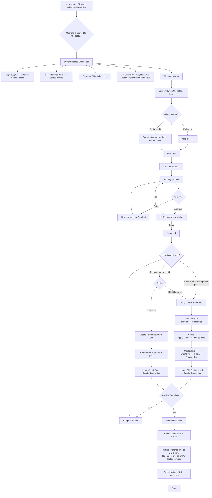
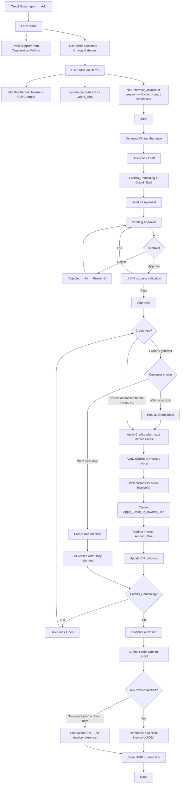
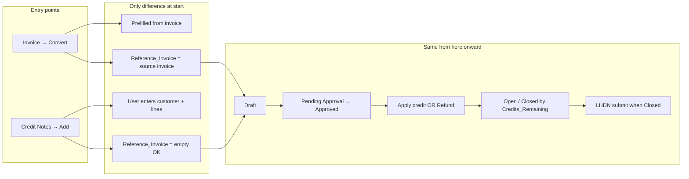
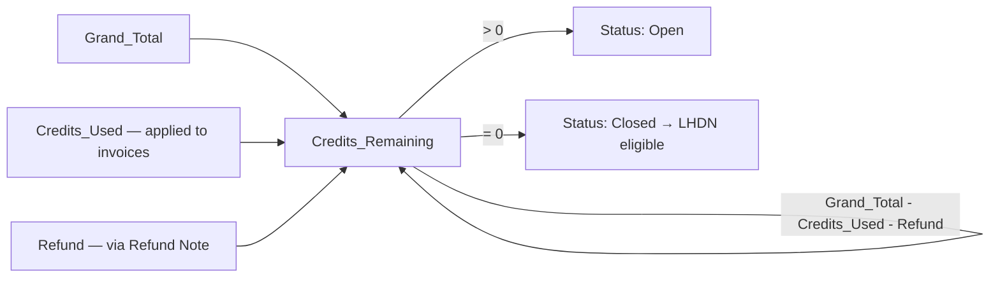

# Credit Note — Correct End-to-End Flow

## 1. Credit Note from Invoice (Convert)

## 2. Credit Note from Credit Notes Module (Manual)

## 3. Entry Points — Where They Differ vs Merge

## 4. Balance Logic (Both Paths)

