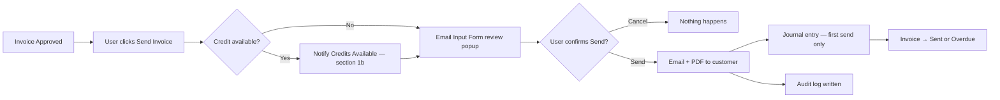
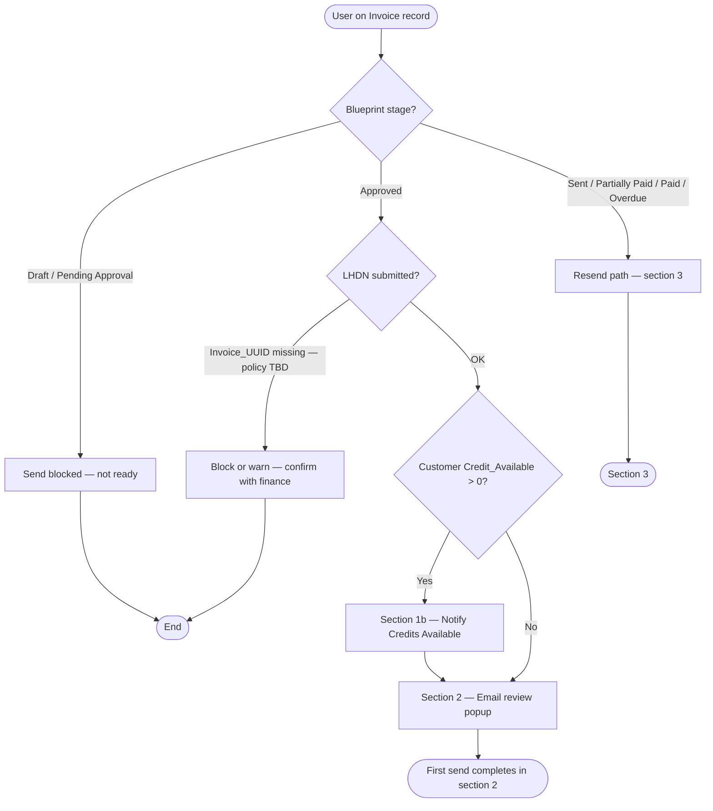
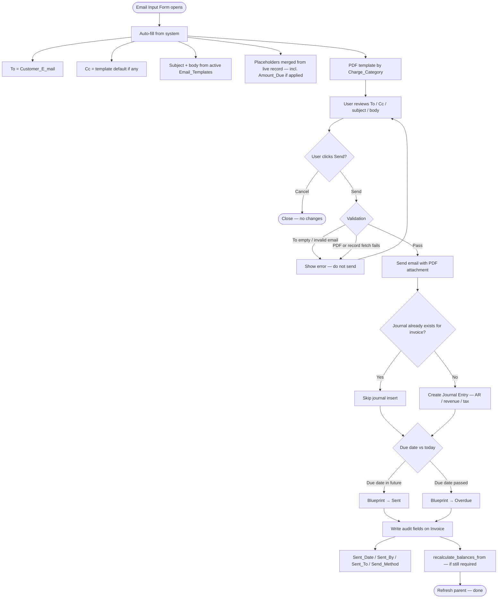
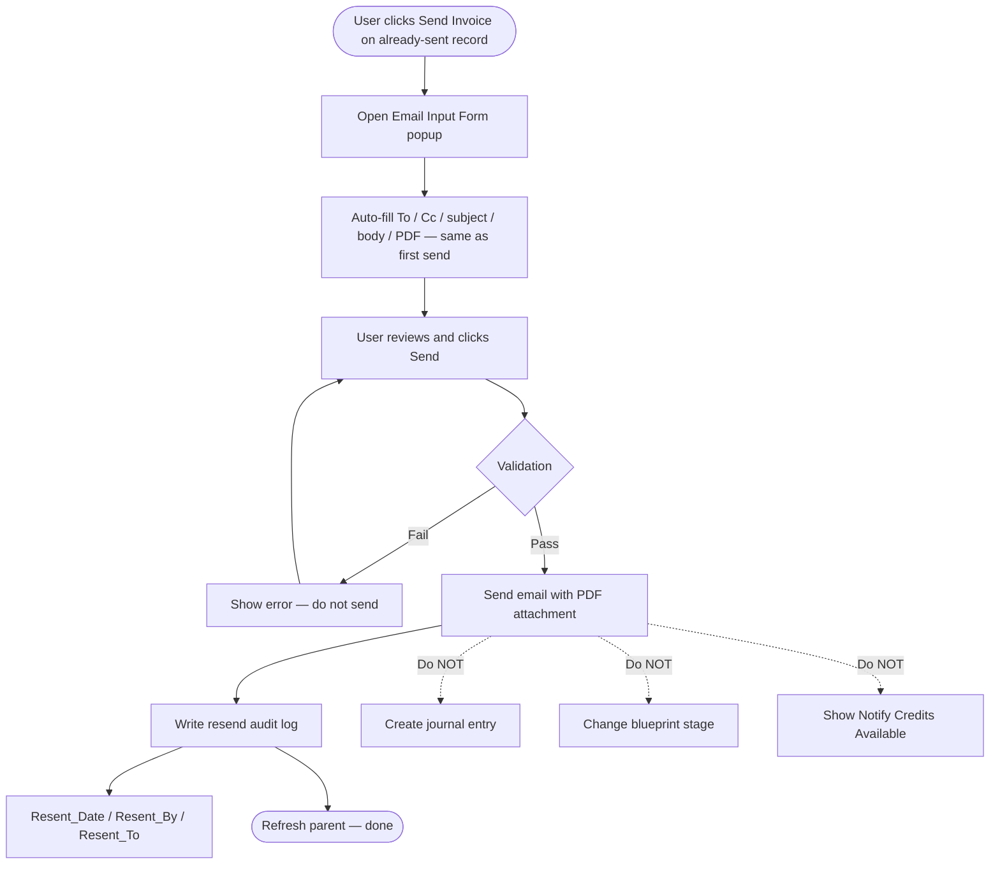
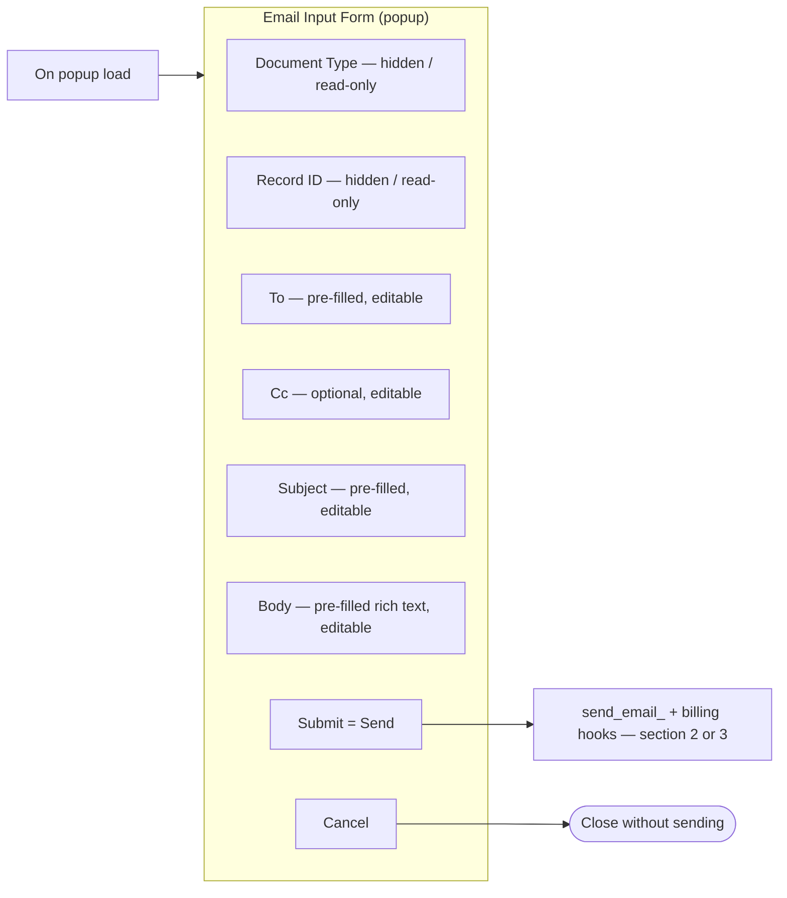
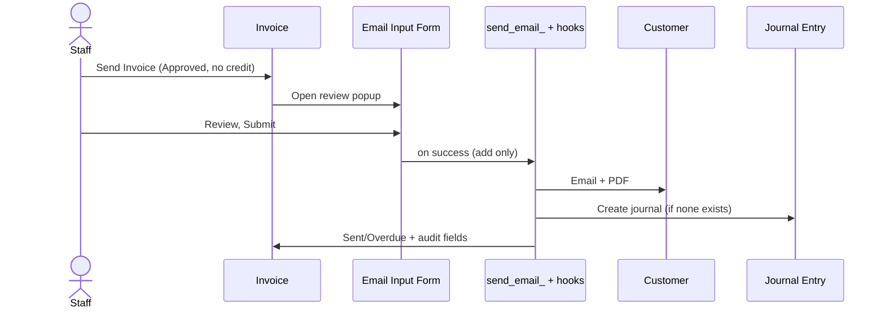
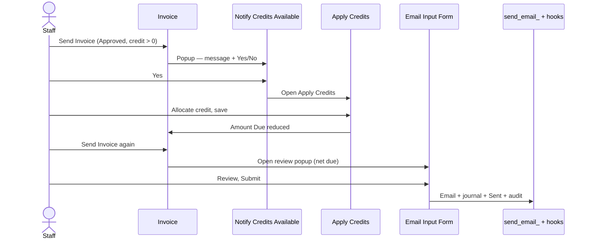
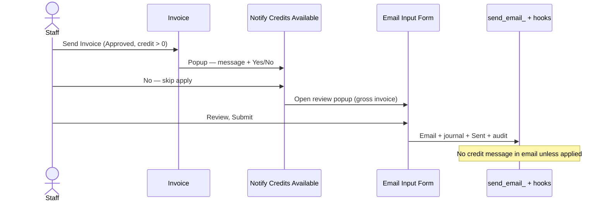

# Correct Send-Email Flow (Target State)

**Purpose:** Define how customer document emails **should** work in XMT Billing after the send-email fix. This is the governed flow finance should sign off on — aligned with Zoho Books (review popup before send) plus XMT blueprint and journal rules.

**Scope (this document):** **Invoice only.** Pro forma, debit note, and other documents follow the same pattern later — debit note credit popup is explicitly **out of scope** for this phase.

**Related:** Audit findings and fix requirements → [`overview.md`](./overview.md)

**Principle:** One **Send** button per document type. Review popup **before** email leaves. First send = email + status + GL + audit log. Resend = email + audit log only.

---

## At a glance (invoice, no credit)



**Plain English:** Approve → Send → (credit question if needed) → check email → confirm → customer gets PDF, books updated, invoice marked sent.

---

## 1. Entry — which button, when? (invoice)

There is **only one** customer-send action: **Send Invoice**. The separate **Send Email** button is **removed**.



**Plain English:**

| Stage | What happens |
|-------|----------------|
| Draft / Pending Approval | Cannot send — invoice not approved yet |
| Approved | Send allowed — first official send |
| Approved + credit on account | **Notify Credits Available** first (section 1b), then email review popup |
| Approved, no credit | Straight to **Email Input Form** review popup |
| Sent / Partially Paid / Paid / Overdue | Resend only — section 3 (no credit notify, no second journal) |

**LHDN note:** Live blueprint may require `Invoice_UUID` before treating send as complete. Confirm with finance whether send is blocked until e-invoice is submitted, or whether that is a separate action. Document the decision in UAT.

---

## 1b. Notify Credits Available (invoice only)

### What it is

An **internal staff popup** — not a customer email, not a saved record (`store data in zc = false`). It appears when staff click **Send Invoice** on an **Approved** invoice and `Customer.Credit_Available > 0`.

**Plain English:** Before the email review screen, the system asks finance: *“This customer still has credit on account — do you want to apply it to this invoice?”*

### When it appears (timing)

| When | Does notify popup show? |
|------|-------------------------|
| First send, Approved, credit > 0 | **Yes** |
| First send, Approved, no credit | **No** — go straight to email popup |
| Resend (Sent / Paid / etc.) | **No** — credit was already a first-send decision |
| Customer emailed finance last week asking to apply credit | Staff still sees popup **at send click** — earlier conversation is not stored in this form |

**Plain English:** Customer talk usually happens **before**; this popup is the **system check on send day**.

### What staff see on the popup

Hidden fields (populated from URL, used by backend): `Invoice`, `Invoice_No`, `Customer_Name`, `Customer_Code`, `Customer_Email`, `Type_Of_Action`.

**Visible to staff:**

```
┌─────────────────────────────────────────────────────────────┐
│  Notify Credits Available                            [X]  │
├─────────────────────────────────────────────────────────────┤
│                                                             │
│  {Customer_Name} has a credit balance of {Credit_Available}. │
│  Would you like to apply it to this Invoice {Invoice_No}?   │
│                                                             │
│              [ Yes ]              [ No ]                    │
│                                                             │
└─────────────────────────────────────────────────────────────┘
```

| Element | Source |
|---------|--------|
| Message text | Built in `Send_Invoice` when opening popup |
| **Yes** | Submit button → `Open_Form_Apply_Credit_Fo` |
| **No** | Button → skip apply, continue send path |

There is **no Cancel** that means “abort entire send” — **No** means *“do not apply credit; continue to send flow.”*

**Plain English:** Staff only see the question and two choices.

### Full credit branch (target state)

```mermaid
flowchart TD
  A([Staff clicks Send Invoice — Approved, credit > 0]) --> B[Notify Credits Available popup]

  B --> C{Staff choice}

  C -->|Yes| D[Close notify popup]
  D --> E[Open Apply Credits form — full screen]
  E --> F[Staff selects credit note(s) + amounts]
  F --> G[Save — invoice Amount Due reduced]
  G --> H[Staff clicks Send Invoice again on invoice]
  H --> I{Credit still > 0?}
  I -->|Yes| B
  I -->|No| J[Email Input Form — section 2]
  G --> J

  C -->|No| K[Skip apply — credit stays on account]
  K --> J

  J --> L[Staff reviews email + PDF]
  L --> M[Submit — section 2 backend]
  M --> N[Email + journal + Sent + audit]

  B -->|Close X without Yes/No| O([No send — invoice stays Approved])
```

**Plain English:**

| Choice | Meaning |
|--------|---------|
| **Yes** | Go apply credit on the next screen. **Send does not happen yet.** After apply, click **Send Invoice** again → email review popup → official send. |
| **No** | Don’t apply credit now. Go to email review popup → send **full** invoice (customer may pay gross or ask to apply later). |
| Close popup without choosing | Nothing sent; invoice stays **Approved**. |

### Yes path — step by step

1. Staff clicks **Yes** on notify popup.  
2. Notify popup closes.  
3. **Apply Credits** form opens (`#Form:Apply_Credits`) with invoice and customer context pre-filled.  
4. Staff allocates credit (which credit note, how much) and saves.  
5. Invoice updates: `Total_Amount_Credit_Applied`, `Amount_Due` reduced.  
6. Staff returns to invoice and clicks **Send Invoice** again.  
7. If **remaining** `Credit_Available > 0`, notify may appear again (optional apply more).  
8. When ready, **Email Input Form** opens (section 2).  
9. PDF and email should reflect **net amount due** after credit applied.  
10. On submit: email + journal (first send) + Sent + audit — **only once**, with journal idempotency guard (no duplicate if journal already exists).

**Plain English:** Yes = apply first, then go through the normal send + email check flow.

### No path — step by step

1. Staff clicks **No** on notify popup.  
2. **No** credit applied; `Credit_Available` unchanged on customer.  
3. **Email Input Form** opens immediately (section 2) — **not** direct send without review (fix vs today).  
4. Staff reviews email; PDF shows **gross** invoice (full amount).  
5. On submit: email + journal + Sent + audit.

**Plain English:** No = send the full bill; customer credit stays for later.

### Customer email content when credit is involved

| Situation | What customer email / PDF should show |
|-----------|----------------------------------------|
| Credit **applied** before send | Net **Amount Due**, credit applied line on invoice/PDF if template supports it |
| Credit **not** applied (staff clicked **No**) | **Gross** invoice only — **do not** auto-add “you have RM X credit available” |
| Customer asked by email to apply credit | Staff clicks **Yes** and applies — not a special email template |

**Plain English:** Only show credit on the customer document when you actually used it on this invoice.

### `Type_Of_Action` on notify form

Form supports `Send Invoice` and `Mark As Sent`. For this **send-email fix**, only **`Send Invoice`** is in scope:

| Type | Target behaviour |
|------|------------------|
| **Send Invoice** | Flows above → email review popup → customer email |
| **Mark As Sent** | Out of scope here — mark status without customer email; define separately if still used |

`Send_Invoice` record action passes `Type_Of_Action=Send Invoice` when opening notify popup.

### What must NOT happen (credit path)

| Bad behaviour | Plain English |
|---------------|---------------|
| **No** sends email without email review popup | Staff must still check email before send |
| **Yes** auto-sends invoice without Apply Credits screen | Staff must explicitly apply amounts |
| **Yes** creates journal before email review submit | Books and email must align on one confirm |
| Duplicate journal after apply + send | Guard: skip insert if `Journal_Entry` already linked to invoice |
| Customer email mentions unused credit on gross send | Confuses customer about amount due |
| Notify popup on resend | Resend is section 3 only — no credit gate |

### Today vs target (credit path)

| Step | Today (wrong) | Target |
|------|---------------|--------|
| **No** on notify | Sends email **immediately** — no email review popup | **Email Input Form** → then send + journal + Sent |
| **Yes** on notify | Opens Apply Credits — OK | Same, then **Send Invoice again** → email popup |
| After apply | Staff must manually send again — OK | Document explicitly; optional future: return to send wizard |
| Credit in customer email | Not in template | Net due only if credit applied |

---

## 2. First send (Approved → Sent)

Triggered when invoice is **Approved**, LHDN policy satisfied (if required), and staff has completed section **1b** when credit exists (or skipped when no credit).



**Plain English (first send checklist):**

1. Popup opens with customer email and template already filled in.  
2. User checks everything and clicks Send.  
3. If anything is wrong (bad email, broken PDF), **stop** — no email goes out.  
4. If OK: customer gets email → journal (once) → invoice becomes Sent (or Overdue) → audit log.

**PDF template by charge category:**

| Charge_Category | Record template |
|-----------------|-----------------|
| Miscellaneous Charges | `Miscellaneous_Invoice` |
| Fixed Charges / Telephone Charges | `Fixed_And_Telephone_Charges_Invoice` |

**One PDF method everywhere:** `Attachments :template:... as PDF` via shared send logic (custom function recommended).

**Journal:** Created here on first send only — `thisapp.invoice.create_journal_on_send(invoiceId)` (to be implemented; logic today duplicated in `Send_Invoice` / `Send_Invoice_To_Customer`).

---

## 3. Resend (Sent / Partially Paid / Paid / Overdue)

Customer already received the invoice once. **No Notify Credits Available** on resend.



**Plain English:** Same review screen, email copy only. No second journal, no stage change, no credit popup.

---

## 4. Review popup (Email Input Form) — what the user sees

Matches the Zoho Books pattern: pre-filled details, human confirmation before send.



**On load (`Handle_Load_Of_The_Form`):**

| Field | Source |
|-------|--------|
| Document_Type | URL param (`Invoice`) |
| Record_ID | URL param |
| To | **Customer_E_mail** from invoice *(fix — not manual today)* |
| Cc | Org default or template config |
| Subject / Body | Active `Email_Templates` where `Template_Type = Invoice` |
| Placeholders | Template placeholder list |

**On submit (`send_email_` + hooks):**

| Step | Action |
|------|--------|
| 1 | Merge placeholders from live invoice record |
| 2 | Attach correct PDF via record template |
| 3 | `sendmail` to To + Cc |
| 4 | First-send or resend backend (section 2 or 3) |
| 5 | Fail closed if any step errors |
| 6 | Refresh parent window |

**Trigger rule:** Send runs on **add only** — not on every edit of an old Email Input row.

**Plain English:** One Submit = one customer email. Cancel = nothing happens.

---

## 5. End-to-end sequences

### 5a. First send — no credit



### 5b. First send — credit available, staff clicks Yes



### 5c. First send — credit available, staff clicks No



---

## 6. Other document types (later)

**Out of scope for this phase.** After invoice send is stable:

| Document | Notes for future doc |
|----------|----------------------|
| Pro Forma Invoice | Same email popup pattern; journal rules differ |
| Debit Note | Notify credit popup exists today — **fix separately**; journal on approve may differ |
| Payment Received / Credit Note | Own send templates |

**Retire (invoice phase):** `Send_Email5`, duplicate `invokeurl` PDF URLs on invoice paths, direct send from `Send_Invoice` without email popup.

---

## 7. What must NOT happen

```mermaid
flowchart TD
  BAD1[Email sent — invoice still Approved] --- X1[❌ Not official]
  BAD2[Email sent — no journal on first send] --- X2[❌ Books wrong]
  BAD3[Two buttons — two different PDFs] --- X3[❌ Customer confusion]
  BAD4[Send from Draft] --- X4[❌ Unapproved billing]
  BAD5[PDF fails — email still sent] --- X5[❌ Silent failure]
  BAD6[Edit old Email Input row — resend again] --- X6[❌ Accidental duplicate]
  BAD7[No log of who / when / to whom] --- X7[❌ Audit fail]
  BAD8[Notify No — bypasses email review popup] --- X8[❌ Today bug — fix required]
  BAD9[Duplicate journal after credit apply + send] --- X9[❌ Double booking]
  BAD10[Gross email says credit available] --- X10[❌ Customer confusion]
```



---

## 8. Comparison — today vs target (invoice)

| Step | Today (wrong) | Target (this document) |
|------|---------------|------------------------|
| Buttons | Send Invoice **and** Send Email | **Send Invoice** only |
| Review before send | Only on Send Email | **Always** on Send |
| Credit notify **No** | Email + journal + Sent **without** review popup | **Email popup first**, then send + journal + Sent |
| Credit notify **Yes** | Apply Credits — then manual send again | Same, then **email popup** before send |
| First send (no credit) | Send Invoice: GL + stage, **no popup** | Credit gate (if any) → **email popup** → GL + stage + email |
| Send Email button | Email only, **no GL / stage** | **Removed** |
| PDF method | Mixed `template:` and `invokeurl` | **One method** (`template:... as PDF`) |
| To address | Manual in popup | **Auto-fill** from customer |
| Resend | May fire immediately | **Email popup** + resend log only |
| Credit on customer email | N/A | Only if **applied** to this invoice |
| Audit trail | Weak on invoice | **Required** on every send |

---

## 9. Finance sign-off checklist (invoice)

### Core send

- [ ] Draft / Pending Approval invoice cannot be sent
- [ ] Approved invoice (no credit) → Email Input Form with To pre-filled
- [ ] First send: email + journal (once) + Sent/Overdue + audit fields
- [ ] Resend: email popup + resend log only — no journal, no stage change, **no credit notify**
- [ ] Cancel / close email popup — no email, no journal, no stage change
- [ ] Bad PDF / bad email blocks send with clear error
- [ ] PDF totals match invoice Grand Total (or net due if credit applied)
- [ ] Miscellaneous vs fixed/telephone PDF correct
- [ ] `Send_Email5` removed from Invoice
- [ ] LHDN / `Invoice_UUID` rule confirmed and tested

### Notify Credits Available

- [ ] Credit > 0 → notify shows **message + Yes/No only** (other fields hidden)
- [ ] Message shows customer name, `Credit_Available`, invoice number
- [ ] **Yes** → Apply Credits opens → after save, invoice Amount Due reduced
- [ ] **Yes** → send does **not** complete until staff clicks Send Invoice again and passes email popup
- [ ] **No** → **Email Input Form** opens (not direct send)
- [ ] **No** → gross invoice emailed; credit remains on customer account
- [ ] Close notify without Yes/No → nothing sent; invoice stays Approved
- [ ] Customer email does **not** mention unused credit on gross send
- [ ] After credit applied, PDF/email reflects **net** Amount Due
- [ ] No duplicate journal if send clicked after partial apply workflow
- [ ] Notify popup does **not** appear on resend (Sent+)

### Implementation notes

- [ ] Journal logic in one custom function — not duplicated in notify / send paths
- [ ] Audit fields (`Sent_Date`, etc.) exist on Invoice form or are added
- [ ] `send_email_` triggers on **add only**

---

## 10. Files in scope (invoice phase)

| File | Role |
|------|------|
| `application/forms/Invoice/workflow/actions/Send_Invoice.deluge` | Open notify (if credit) or email popup; remove direct sendmail |
| `application/forms/Notify Credits Available/workflow/Open_Form_Apply_Credit_Fo.deluge` | Yes → Apply Credits |
| `application/forms/Notify Credits Available/workflow/Send_Invoice_To_Customer.deluge` | **Replace** No-path direct send with open Email Input Form |
| `application/forms/Email Input Form/workflow/send_email_.deluge` | Email + first-send/resend hooks |
| `application/forms/Email Input Form/workflow/Handle_Load_Of_The_Form.deluge` | Pre-fill To, template |
| `application/forms/Invoice/workflow/actions/Send_Email5.deluge` | **Remove** |
| `Custom Functions/invoice/create_journal_on_send` | **Add** — shared journal insert with idempotency guard |

---

*Last updated: 2026-06-30 — invoice-focused target state including Notify Credits Available.*
