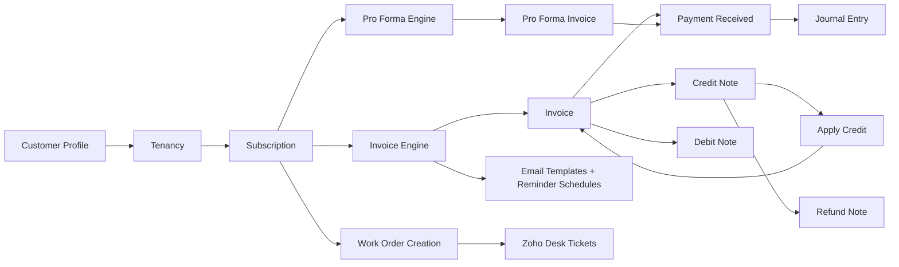

# XMT Billing System - Architecture Overview (Inferred)

**Active refactor tracker:** [tenancy_subscription_cleanup.plan.md](tenancy_subscription_cleanup.plan.md) (Tenancy + Subscription cleanup; Phase 0 baseline frozen at commit `39be617`).

## 1) Scope and Confidence

This document is inferred from static scan of `XMT___Billing_System.ds` (Zoho Creator export, ~48k lines).  
It is intended for **big-picture onboarding**, not as source-of-truth design docs.

Confidence:
- **High**: module inventory, forms/reports/pages, workflow/schedule/blueprint existence, integration touchpoints.
- **Medium**: exact end-to-end runtime behavior in all branches.
- **Low**: business intent behind legacy/disabled/commented logic.

## 2) Platform and Runtime Shape

- Platform: **Zoho Creator** (single application export).
- App type: Billing + receivables + e-invoice + work-order assisted operations.
- Primary architecture style: **Monolithic low-code app** with:
  - data schema in forms,
  - business logic in Deluge workflows/functions,
  - reporting views in reports/pages,
  - automation through schedules + blueprints.

Core top-level blocks detected:
- `forms`
- `reports`
- `pages`
- `variables`
- `functions` (global/custom Deluge functions)
- `workflow`
- `schedule`
- `blueprint`
- `functions` (record action buttons/handlers)
- `connections`
- channel UI configs (`web`, `phone`, `tablet`)

## 3) Inventory Snapshot

- Forms: **38**
- Reports/lists: **49**
- Pages: **7**
- Workflow trigger matches (`on add/edit/user input/success/...`): **~735**
- Record events (`record event = on ...`): **~339**
- `on user input of ...`: **~138**
- `on success`: **~33**
- Schedules (`type = schedule`): **9**
- Blueprints (`type = Blueprint`): **4**
- Record action functions (`type = functions`): **27**
- Connections: **2** (`zdesk`, `zoho_creator_connection`)

## 4) Domain Model (Business Modules)

### Customer and Contracting
- `Customer_Profile`
- `Tenancy`
- `Subscription`
- `Subscription_Line_Item`

### Billing Documents
- `Invoice`
- `Pro_Forma_Invoices` (deposits)
- `Credit_Note`
- `Debit_Note`
- `Refund_Note`

### Collections / Receivables
- `Payment_Received`
- `Payment_Received_Line_Item`
- `Apply_Credit_To_Invoices`
- `Apply_Credit_To_Invoice_Line`
- `Customer_Statement`

### Accounting and Master Data
- `Journal_Entry`, `Journal_Entry_Line_Item`
- `Chart_Of_Account`, `Bank`, `Tax`, `Payment_Term`, `Transaction_Type`
- `Business_Segment`, `Business_Unit`
- `Circuit_ID`, `Circuit_ID_Type`
- `Organization_Settings`

### Ops / Integrations
- `Work_Order_Creation`
- `Email_Templates`, `Email_Input_Form`
- `Announcement`, `Alert_Message`

## 5) Logical Architecture

Interpretation:
- **Tenancy + Subscription** drive recurring billing logic.
- Billing outputs multiple commercial documents (invoice, pro forma, debit/credit/refund notes).
- Payment and credit application close receivables.
- Journal entries and reports are downstream views/accounting outputs.

## 6) Runtime Layers

### Layer A: Data + UI (Forms)
- Forms hold both schema and front-end constraints (hide/disable, picklists, subforms, defaults).
- Heavy use of duplicated customer/supplier snapshot fields inside document forms (invoice-like denormalized copies).

### Layer B: Business Logic (Deluge)
- Large global function zone starts around `variables/functions` and continues for ~28k lines.
- Namespaced call style (examples): `thisapp.invoice.*`, `thisapp.tenancy.*`, `thisapp.subscription.*`, `thisapp.permissions.*`, `thisapp.work_order_creation.*`.
- Major responsibilities:
  - invoice number generation,
  - billing-period computations,
  - proration calculations,
  - status transitions,
  - conversion flows (invoice -> debit/credit/refund),
  - ticket creation/update in Desk.

### Layer C: Process Orchestration
- **Workflow (form events)**: validation, field derivation, UI control, lifecycle actions.
- **Schedules**: invoice generation and reminder/status jobs.
- **Blueprints**: approval/state machines for key documents.
- **Record actions (`type = functions`)**: user-triggered commands (send invoice, convert doc types, etc.).

### Layer D: Read Models / Reporting
- Reports (`default list`, `list`, `spreadsheet`) as operational views.
- Dashboard pages with ZML.
- Embedded Zoho Analytics pages for aging/audit/business segment reporting.

## 7) Key Automated Flows (Inferred)

### Flow 1 - Recurring Invoice Creation
1. Subscription/Tenancy defines billing cycle, bill-for mode, next billing date.
2. Schedule or workflow computes billing window and quantity/proration.
3. Engine creates invoice records + subform line items.
4. Subscription billing dates are updated.

### Flow 2 - Reminder and Overdue Management
1. Schedule detects invoice due-date offsets.
2. Fetches active email template and resolves placeholders.
3. Sends reminder with PDF attachment.
4. Separate schedule flips status to `Overdue` based on due date.

### Flow 3 - Document Conversion
1. Record action on invoice triggers conversion.
2. New note record is inserted (debit/credit/refund variant).
3. Subforms are copied row-by-row.
4. New form opened in popup; failure routed to `Alert_Message`.

### Flow 4 - Work Order / Desk Integration
1. Subscription or work-order actions determine ticket creation path.
2. Desk account/contact lookup or create via REST.
3. Ticket creation against Desk API.
4. Ticket metadata reflected back in `Work_Order_Creation`.

## 8) State Management

Blueprints detected:
- `Invoice_Blueprint`
- `Credit_Note_Blueprint`
- `Deposits_Blueprint` (Pro Forma)
- `Debit_Note_Blueprint`

Common lifecycle states observed across docs:
- `Draft`
- `Pending Approval`
- `Approved` / `Rejected`
- `Sent`
- `Partially Paid`
- `Paid`
- `Overdue`

## 9) Integration Architecture

### Inbound/Outbound Integrations
- **Zoho Desk** via `zdesk` OAuth connection.
  - tickets/accounts/contacts endpoints used with `invokeurl`.
- **Zoho Creator API** via `zoho_creator_connection`.
  - record fetch/update APIs used in workflows/schedules.
- **Zoho Analytics** dashboards embedded in pages.

### Communication Channels
- email notifications via `sendmail` in multiple workflows and schedules.
- popup/report redirections via `openUrl` / `openURL`.

## 10) High-Risk Flaws and Technical Debt (Observed)

### Security / Secrets
- Hardcoded secrets/tokens in app variables:
  - `thisapp.variables.Client_ID`
  - `thisapp.variables.Client_Secret`
  - `thisapp.variables.Zoho_Access_Token`
- Risk: credential leakage from export sharing/versioning.

### Monolith Complexity
- Very large centralized Deluge logic block (~28k lines).
- High coupling between forms and functions.
- Hard to test/reason; regression risk is high.

### Logic Duplication
- Similar loops and billing logic repeated across many branches.
- Multiple near-duplicate schedules/workflows.
- Increased drift risk when patching one path.

### Reliability Concerns
- Some schedules are `inactive`; behavior may diverge between expected and actual.
- Presence of hardcoded date logic in schedule (e.g., fixed date condition) indicates potential stale test logic in production path.
- Large sections of commented-out integration code suggest partial migrations/abandoned branches.

### Data/Config Smells
- Long hardcoded picklists (e.g., currency/classification) embedded repeatedly instead of centralized config.
- Denormalized customer/supplier snapshots duplicated across multiple document forms; can cause sync inconsistencies.

### Operational Risks
- Heavy workflow density (~700+ trigger occurrences) with side effects (email, API, status changes) may create hidden order dependencies.
- External URL dependencies (public/permalink style URLs) can be brittle if IDs/permissions change.

## 11) Suggested Mental Model for Daily Work

When debugging/changing behavior, follow this order:
1. **Which document/module?** (`Invoice`, `Subscription`, `Payment_Received`, etc.)
2. **Which trigger path?** (`on load`, `on user input`, `on success`, schedule, blueprint transition, record action)
3. **Which shared function?** (`thisapp.invoice.*`, `thisapp.tenancy.*`, etc.)
4. **Which side effects?** (insert/update/delete, email, invokeurl, status transition)
5. **Which report/page surfaces outcome?**

## 12) Suggested Future Refactor Targets (Practical)

1. Move secrets to secure connections/variables management, rotate exposed credentials.
2. Build a canonical billing engine function set and route all invoice-generation paths through it.
3. De-duplicate reminder workflows/schedules and template resolution logic.
4. Add structured logging/error envelopes around integration calls (`invokeurl` responses).
5. Produce module-level docs (`invoice`, `payment`, `work_order`, `notes`) from current code paths.

## 13) Bottom Line

This is a mature but highly coupled **billing monolith on Zoho Creator**: strong functional coverage (contracts -> billing -> collections -> notes -> reminders -> integrations), with substantial technical debt and security/configuration risks.  
You can onboard effectively by treating `Tenancy/Subscription -> Invoice/Pro Forma -> Payment/Credit` as the core chain, then layering in Desk integration and approval blueprints.
